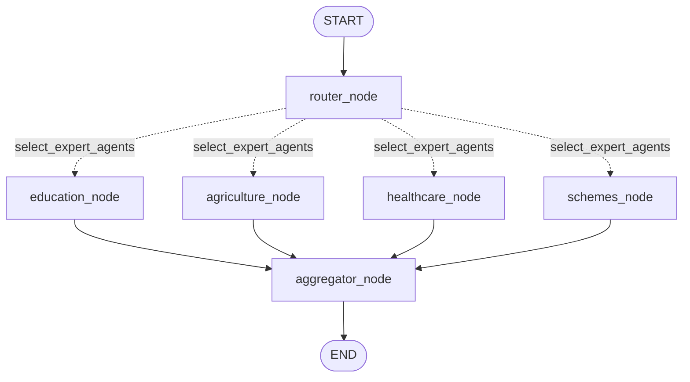

# LangGraph Workflow Architecture

This document provides the visual and structural representation of the compiled **LangGraph** multi-agent workflow used in JanMitra AI.

## Workflow Sequence

1. **`__start__`**: Accepts initial user payload (`message`, `session_id`, `language`).
2. **`router_node`**: Analyzes intent and identifies target expert agents (`Education`, `Agriculture`, `Healthcare`, `Government Schemes`).
3. **`select_expert_agents()`**: Evaluates routing state and dynamically fans out to selected agent nodes in parallel.
4. **`[expert_agent_nodes]`**: Each selected expert node retrieves relevant domain data and appends its response to shared state.
5. **`aggregator_node`**: Receives outputs from all executed agents, deduplicates action items and sources, prioritizes tasks, and formats the unified `ChatResponse`.
6. **`__end__`**: Returns the frozen API response dictionary (`response`, `agents`, `action_plan`, `sources`).
